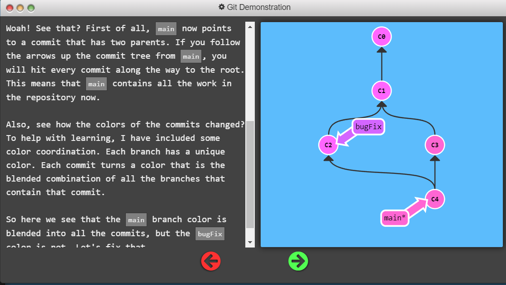
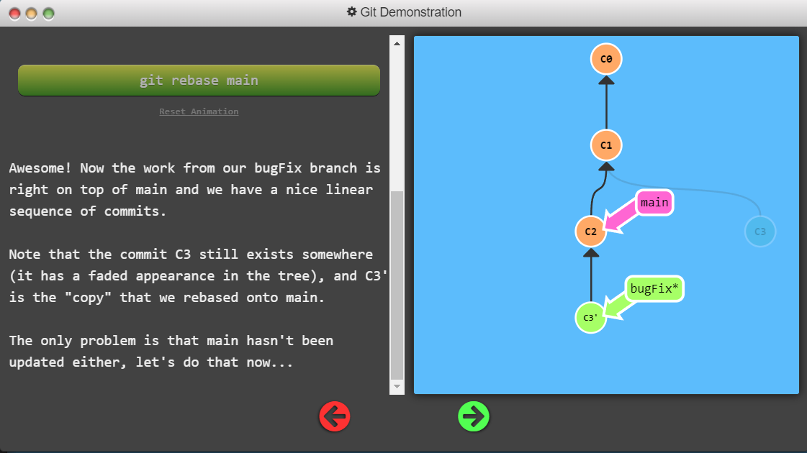
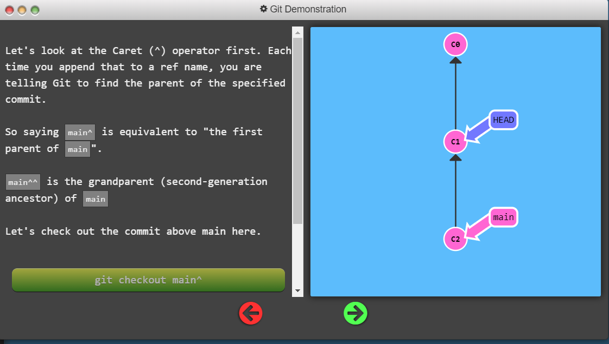
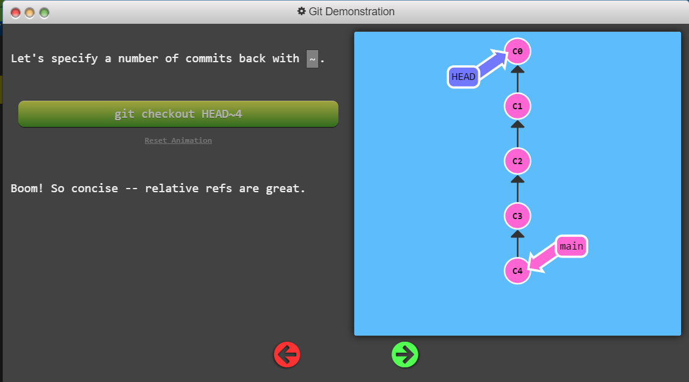
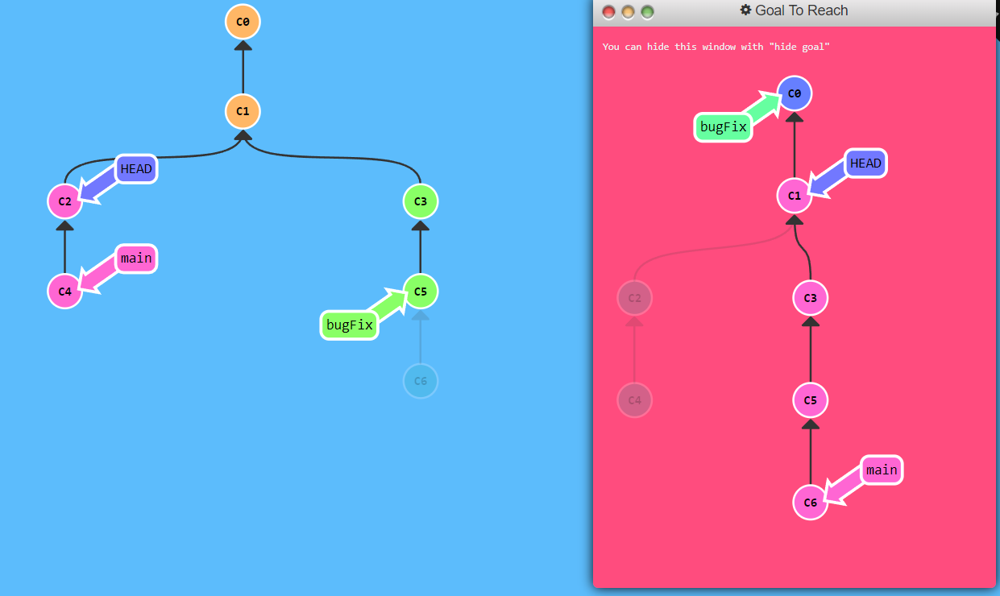
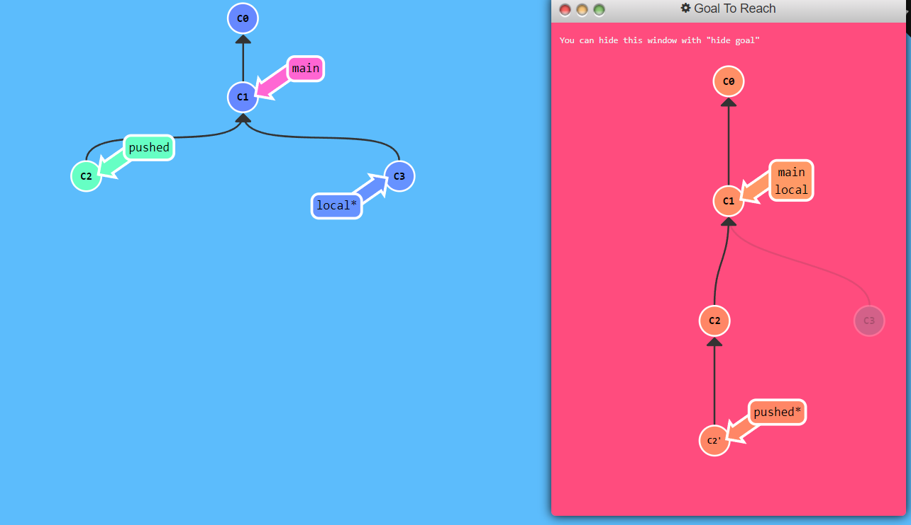
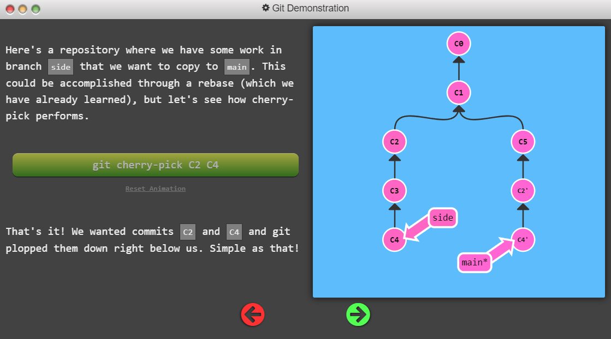
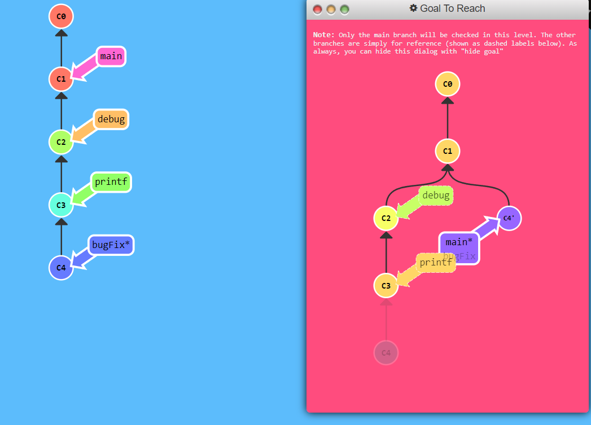

# LEARN GIT BRANCHING SOLUTIONS AND NOTES

> Interested in learning Git? Well you've come to the right place! "Learn Git Branching" is the most visual and interactive way to learn Git on the web;
> you'll be challenged with exciting levels, given step-by-step demonstrations of powerful features, and maybe even have a bit of fun along the way.

**Website:** [https://learngitbranching.js.org/](https://learngitbranching.js.org/)

## About

There are two levels of practice: `Main` and `Remote`, each with its own sub-levels.

## Main

### A. Introduction Sequence

> A nicely paced introduction to the majority of git commands

#### 1. Introduction to Git Commits

```console
git commit
git commit
```

#### 2. Branching in Git

> just remember that a branch essentially says "I want to include the work of this commit and all parent commits."

_Note: In Git version 2.23, a new command called `git switch` was introduced to eventually replace `git checkout`, which is somewhat overloaded (it does a bunch of different things depending on the arguments).
The lessons here will still use `checkout` instead of `switch` because the `switch` command is still considered experimental and the syntax may change in the future. However you can still try out the new `switch` command in this application, and also learn more here._

**Once this window closes, make a new branch named bugFix and switch to that branch.**

```console
git checkout -b bugFix
```

#### 3. Merging in Git

> Merging in Git creates a special commit that has two unique parents.
> A commit with two parents essentially means "I want to include all the work from this parent over here and this one over here, and the set of all their parents."

Stand in `main`, run `git merge bugFix` -> `bugFix` is not changed, `main` points to new commit that has two parents.



Jump to `bugFix` and merge it into `main` -> `git checkout bugFix; git merge main`

**Requirements for this level:**
- Make a new branch called `bugFix`
- Checkout the `bugFix` branch with git checkout `bugFix`
- Commit once
- Go back to `mai`n with `git checkout`
- Commit another time
- Merge the branch `bugFix` into `main` with `git merge`


```console
git checkout -b bugFux
git commit
git checkout main
git commit
git merge bugFix
```

#### 4. Rebase Introduction

> The second way of combining work between branches is rebasing.
> The advantage of rebasing is that it can be used to make a nice linear sequence of commits. The commit log / history of the repository will be a lot cleaner if only rebasing is allowed.

Stand in `bugFix` branch, run `git rebase main` -> `bugFix` branch is right on top of `main`.



But `main` has not been updated. Checkout branch `main` and `git rebase bugFix`.

**Requirements for this level:**
- Checkout a new branch named `bugFix`
- Commit once
- Go back to `main` and commit again
- Check out `bugFix` again and rebase onto `main`

```console
git checkout -b bugFix
git commit
git checkout main
git commit
git checkout bugFix
git rebase main
```

### B. Ramping Up

> The next serving of 100% git awesomes-ness. Hope you're hungry

#### 1. Detach yo' HEAD

> HEAD is the symbolic name for the currently checked out commit -- it's essentially what commit you're working on top of.
>
> HEAD always points to the most recent commit which is reflected in the working tree. Most git commands which make changes to the working tree will start by changing HEAD.
>
> Normally HEAD points to a branch name (like bugFix). When you commit, the status of bugFix is altered and this change is visible through HEAD.

This video explains what is [HEAD](https://www.youtube.com/watch?v=HvDjbAa9ZsY).

You can change `HEAD` pointer position by `git checkout <commit hash>`.

```console
git checkout C4
```

#### 2. Relative Refs (^)

> Relative refs make it easier to move up or down a relative number of times in the commit tree.
>
> With relative refs, you can start somewhere memorable (like the branch bugFix or HEAD) and work from there.
>
> - Moving upwards one commit at a time with `^`
> - Moving upwards a number of times with `~<num>`



```console
git checkout bugFix
```

#### 3. Relative Refs #2 (~)

Moving 1000 times? Too long to use caret `^` -> use tilde `~` instead.

Run `git checkout bugFix^` 1000 times is equivalent to run `git checkout bugFix~1000` once.



**BRANCH FORCING** You can reassign a branch to specify commit by `git branch -f main HEAD~3`.

_Note: In a real git environment `git branch -f command` is not allowed for your current branch. You can set for another branch only._

**To complete this level, move `HEAD`, `main`, and `bugFix` to their goal destinations shown.**



```console
git checkout HEAD~1
git branch -f bugFix HEAD~1
git branch -f main C6
```

#### 4. Reversing Changes in Git

> There are two primary ways to undo changes in Git: `git reset` and `git revert`.
>
> - `git reset` reverses changes by moving a branch reference backwards in time to an older commit. -> as if the commit had never been made.
> - `git revert` reverses changes and share those reversed changes with others.

`git reset` will delete commit from git log -> This method works find if you are just working locally, but not so good if you are collaborating with others using a remote repo. -> `git revert` solves that problem.

**To complete this level, reverse the most recent commit on both local and pushed. You will revert two commits total (one per branch).**

Keep in mind that pushed is a remote branch and local is a local branch -- that should help you choose your methods.



Since `local` branch has not been commited yet, we can easily delete it by `reset`. But branch `pushed` is on remote, so we must use `revert`.

```console
git reset HEAD~1
git checkout pushed
git revert pushed
```

### C. Moving Work Around

> "Git" comfortable with modifying the source tree :P

#### 1. Cherry-pick Intro



> Command `git cherry-pick <commit1> <commit2> <...>` will copy series of selected commit and put it below current position (`HEAD`).

**To complete this level, simply copy some work from the three branches shown into main. You can see which commits we want by looking at the goal visualization.**

```console
git cherry-pick C3 C4 C7
```

#### 2. Interactive Rebase Intro

> Git cherry-pick is great when you know which commits you want (and you know their corresponding hashes). If you do not? Use `git rebase -i <commit>`.

```console
git rebase -i HEAD~4
```

### D. A Mixed Bag

> A mixed bag of Git techniques, tricks, and tips

#### 1. Grabbing Just 1 Commit

> Let's say you are debugging a problem, you go back and add some print debug statements and print statements. Each one of those has their own commit now. Now you solve the problem and you just want your `bugFix` commit back into the `main` branch without bringing along your debug commits. That's the use case for this problem.
>
> Two potential solutions are suggested: `git rebase -i` or `git cherry-pick`.



```console
git checkout main
git cherry-pick C4
```

or

```console
git rebase -i c1 // delete commits c2 and c3
git branch -f main c4'
```

#### 2. Juggling Commits

#### 3. Juggling Commits #2

#### 4. Git Tags

#### 5. Git Describe

### E. Advanced Topics

> For the truly brave!

#### 1. Rebasing over 9000 times

#### 2. Multiple parents

#### 3. Branch Spaghetti

## Remote

### A. Push & Pull -- Git Remotes!

> Time to share your 1's and 0's kids; coding just got social

#### 1. Clone Intro

#### 2. Remote Branches

#### 3. Git Fetchin'

#### 4. Git Pullin'

#### 5. Faking Teamwork

#### 6. Git Pushin'

#### 7. Diverged History

#### 8. Locked Main

### B. To Origin And Beyond -- Advanced Git Remotes!

> And you thought being a benevolent dictator would be fun...

#### 1. Push Main!

#### 2. Merging with remotes

#### 3. Remote Tracking

#### 4. Git push arguments

#### 5. Git push arguments -- Expanded!

#### 6. Fetch arguments

#### 7. Source of nothing

#### 8. Pull arguments